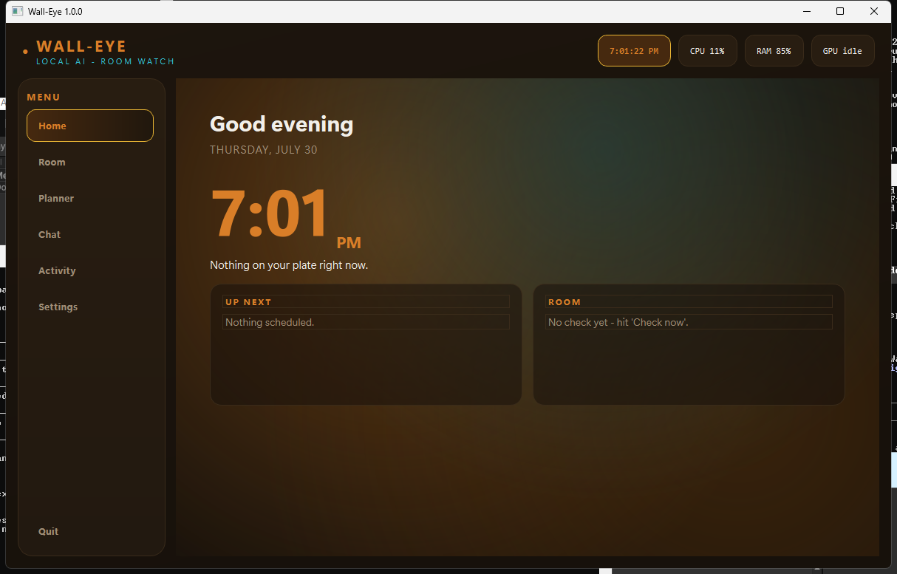

<p align="center">
  
</p>

<h1 align="center">Wall-Eye</h1>

<p align="center">
  An open-source, fully local AI room watcher.<br>
  A cheap ESP32 camera or the webcam you already own, your own GPU, and a
  local vision model - instead of a $50/month cloud subscription.
</p>

<p align="center">
  <a href="https://github.com/nitrocylas/wall-eye/actions/workflows/tests.yml"></a>
  <a href="LICENSE"></a>
  
  
  <a href="https://ko-fi.com/nitrocylas"></a>
</p>

---

Wall-Eye watches your room through a USB webcam or a Wi-Fi camera, asks a
vision model running on your own machine whether the room is a mess (or
whatever else you tell it to watch for), and alerts you with a desktop toast, a
phone push, and optionally a spoken message. Frames never leave your machine.



## Why

Cloud "AI room camera" products cost $100 or more per camera plus a monthly
fee, and every frame of your home goes to someone else's servers. Wall-Eye
does the same job with hardware you probably already own: a webcam you have
lying around, or an ESP32-S3 camera board that costs about $10, plus the GPU
in your PC running a free local vision model through
[Ollama](https://ollama.com). No cloud, no subscription, no account.

also i have adhd i made this because i have a hard time keeping my room tidy so i was like i should have a robot yell at me to clean my room or something so yea

## Features

- **Watch tasks with plain-English prompts** - each task is a prompt checked
  on its own schedule, e.g. "alert if there are two or more out-of-place
  items" or "alert if the 3D print has failed". Per-task camera, interval,
  cooldown (`interval_minutes` / `cooldown_minutes`), priority, and optional
  crop zone.
- **Mess detection with per-surface reasoning** - the default room task forces
  the model to give a verdict for every surface (floor, bed, desk, chairs)
  instead of finding the biggest mess and stopping, so medium clutter gets
  caught too.
- **Reference-photo comparison** - compare the current frame against a saved
  "normal" photo of the room to cut false alarms. A close-up verification
  pass re-crops each reported item and confirms it before alerting, and
  `confirm_checks` requires a condition to hold across consecutive checks.
- **Multi-camera tasks** - one task can watch several angles at once, each
  with its own reference photo; it alerts if any camera sees a problem.
- **Alerts everywhere** - Windows toast, phone push via
  [ntfy](https://ntfy.sh) (free, self-hostable), and spoken alerts in your
  choice of voice: your system text-to-speech, a warm "cute" neural voice
  (Kokoro, optional one-time model download), or a "robot" voice
  (a numpy DSP chain - pitch shift, ring modulation, soft clip - layered on
  the best available base voice). Quiet hours supported.
- **Reminders and planner** - timed reminders, to-do and shopping checklists,
  quick notes, daily habits with streaks, a cleanup checklist, and a focus
  timer, all in the desktop dashboard.
- **Chat with the camera** - a chat panel backed by the same vision model, so
  "what do you see right now?" actually works.
- **100% local** - the only network traffic is to your own camera on your LAN,
  your local Ollama server, and (only if you enable it) your ntfy topic.

## Requirements

- Windows, for now (system tray, toast notifications, and audio playback are
  Windows-specific; the core logic is portable and Linux/macOS ports are
  welcome - see CONTRIBUTING.md)
- Python 3.11+
- [Ollama](https://ollama.com) running locally with a vision model
- A camera. **Any camera that plugs into the PC works out of the box** - a
  USB webcam needs zero extra hardware or flashing; set `source: 0` in the
  config and you are done. Also supported: IP cameras that serve a still or
  stream, a phone running an IP-webcam app, or (optionally) a cheap ESP32-S3
  camera board flashed with the included firmware (see below)
- A GPU is strongly recommended - see Limitations. Any GPU Ollama supports
  works: NVIDIA (CUDA), AMD (ROCm), or Apple Silicon - Wall-Eye itself has
  no GPU-specific code and just talks to Ollama

## Quick start

**No-Python route:** grab the portable build from
[Releases](https://github.com/nitrocylas/wall-eye/releases), unzip it
anywhere, install [Ollama](https://ollama.com) and pull a model
(`ollama pull qwen3-vl:8b-instruct`), then run `Wall-Eye.exe`. Windows
SmartScreen will warn about an unrecognized app the first time - that is
what unsigned hobby software looks like; click "More info" then "Run
anyway", or use the from-source route below if you'd rather not. The
portable build keeps its config next to the exe, includes the voice
extras, and you can switch models from the Settings tab.

**From source:**

```
git clone https://github.com/nitrocylas/wall-eye
cd wall-eye
pip install -r requirements.txt
ollama pull qwen3-vl:8b-instruct
```

On first run the app copies `config.example.yaml` to `config.yaml`, which is
your private, gitignored working config (you can also copy it yourself
beforehand). Edit `config.yaml` (at minimum, check the `cameras:` section
points at your camera), then:

```
python gui.py
```

This opens the dashboard and starts the watcher; closing the window leaves the
engine running in the system tray. To run headless with only the tray icon,
use `pythonw app.py` instead. `python check_once.py` runs a single check from
the command line.

## Choosing a model

Wall-Eye works with **any vision-capable Ollama model** - the model name in
`config.yaml` (`ollama.model`) is passed straight to Ollama, so if you have a
favorite vision model, or a custom fine-tune of your own, drop its name in
and it will very likely just work. The checks send a frame plus a plain
English prompt and parse the reply defensively, so nothing in the pipeline
is tied to one model family.

Recommendations, roughly by hardware:

| Model | VRAM (approx.) | Notes |
|---|---|---|
| `qwen3-vl:8b-instruct` | ~7 GB | Recommended default. Strong at telling objects apart and giving per-surface verdicts. Use the `-instruct` tag; bare "thinking" builds can return empty replies. |
| `qwen2.5vl:3b` | ~3 GB | Best small option; fine for basic mess detection on modest GPUs. |
| `llava:7b` / `llava:13b` | ~5-9 GB | Widely used alternatives; solid general scene description. |
| `minicpm-v` | ~5 GB | Compact and quick. |
| `moondream` | ~2 GB | Tiny; usable for coarse checks on very limited hardware. |

Tips:

- Larger models mostly buy you fewer false alarms and better small-object
  detection, not new features.
- `ollama.ground_model` (optional) can name a second model used only to
  place bounding boxes; leave it empty to use the main model's own boxes.
- If a model gives chatty or malformed replies, try another one - the app
  tolerates imperfect output, but verdict quality is only as good as the
  model.

## Running on cheap hardware

You do not need a gaming PC. Any old x86 laptop or a used ~$100 mini-PC
with 8 GB RAM and no GPU runs Wall-Eye at a slower but perfectly usable
pace - a room check takes a few minutes instead of a few seconds, which
hardly matters when checks run every half hour. Measured with the GPU
disabled on a real room check:

| Hardware | Model to use | Check time (rough) | Notes |
|---|---|---|---|
| 8 GB RAM, no GPU | `qwen2.5vl:3b` | 2-4 min | Cleanest small-model verdicts in testing; respected the "a monitor and keyboard are not clutter" rule |
| 8 GB RAM, no GPU (alternate) | `qwen3-vl:2b-instruct` | 2-4 min | Smaller download, more detailed but slightly noisier; must be the `-instruct` tag |
| 4 GB RAM, no GPU | `qwen3-vl:2b-instruct` | 3-5 min | Close everything else; set `max_image_side: 512` and `num_ctx: 2048` |
| Any used GPU (~$60+, 6 GB VRAM) | `qwen3-vl:8b-instruct` | seconds | The default experience |

Low-spec tips:

- Set `verify_items: false` - the close-up second pass roughly doubles CPU
  work; `confirm_checks: 2` catches the false alarms instead.
- Voice: the system voice costs nothing. The cute voice works on weak CPUs
  too (a spoken sentence takes a few seconds). For the wake word, set
  `listen.whisper_model: tiny.en`.
- Tested and not recommended on CPU: `moondream` (returns empty verdicts
  for this task), `gemma3:4b` (slow on CPU and flags normal desk items as
  mess), `minicpm-v4.6` (does not follow the structured output format).

## Configuration highlights

`config.yaml` is heavily commented and is the full reference (the tracked
template is `config.example.yaml`; the live `config.yaml` is gitignored
because the app writes your settings, including the ntfy topic, back into
it). The short version:

```yaml
cameras:
  main:
    source: 0                             # first USB webcam
  wallcam:
    source: http://192.168.1.50/capture   # ESP32 camera (see firmware/)
    description: wall-mounted wide view of the room

tasks:
- name: room
  camera: main            # or a list: [main, wallcam]
  prompt: Alert if there are two or more out-of-place items in the room.
  interval_minutes: 30
  reference: true         # compare against a saved "normal" photo
```

Other knobs worth knowing:

- `ollama.keep_alive` - how long the model stays in VRAM after a check
  (`5m` frees the GPU between checks; `24h` keeps it loaded; `0` unloads
  immediately).
- `ollama.verify_items` - the close-up second pass that filters false alarms.
- `alerts.confirm_checks` - only alert once a condition holds N checks in a
  row.
- `alerts.quiet_hours` - no alerts in this window (checks still run).
- `voice.voice` - `system`, `cute`, `robot`, or `off`. The cute voice needs
  `pip install kokoro-onnx` (the model downloads once, about 340 MB); it
  also upgrades the robot voice's base audio.
- Per-camera or per-task `zone` - crop to a region of the frame.

After editing, hit "Reload config" on the Settings tab (or restart the app).

## ESP32 Wi-Fi camera

`firmware/roomcam/` is a small LAN-only firmware for ESP32-S3 camera boards
(for example the Seeed XIAO ESP32S3 Sense, roughly $10-15 with camera
included). It serves JPEG stills and an MJPEG stream over plain HTTP with no
cloud, no OTA, and no outbound connections of any kind. See
[firmware/FIRMWARE.md](firmware/FIRMWARE.md) for the build and flash guide,
then point a camera `source` at `http://<camera-ip>/capture`.

If your camera module ships without an IR-cut filter (hazy, magenta-tinted
image), run `tools/enhance_proxy.py` between the camera and Wall-Eye - it
serves a corrected image at `http://127.0.0.1:8090/capture`.

## Talking to Wall-Eye

Optional, off by default, and fully local: enable the voice wake word (on
the Settings tab, or `listen.enabled` in `config.yaml`) and Wall-Eye
listens for its name through your microphone. Speech recognition runs on
your PC with faster-whisper; audio never leaves the machine.

```
pip install faster-whisper sounddevice
```

Then just talk to it:

- "Wall-Eye, what do you see?" - it looks through the camera and describes
  the room out loud.
- "Wall-Eye, check the room" - runs a mess check and speaks the verdict.
- "Wall-Eye, how does it look?" - repeats the latest verdict.
- "Wall-Eye, what time is it?" - the classics work too.
- Anything else after the name becomes a chat message, answered in the chat
  panel and spoken aloud.

It answers in whichever voice you picked in settings - the robot voice is
obviously the correct choice. "Wally", "wall eye" and similar
pronunciations are recognized as the wake word; say the name, then the
request, in one sentence.

## Phone notifications

Wall-Eye pushes alerts through [ntfy](https://ntfy.sh), which is free and
self-hostable. Set `alerts.ntfy_topic` in `config.yaml` to a unique,
hard-to-guess topic name (e.g. `my-room-x7q2k`), then subscribe to that topic
in the ntfy app on your phone. Task `priority` maps to ntfy priority, so a
failed 3D print can buzz through Do Not Disturb while routine mess alerts stay
quiet.

**The topic name is effectively a password.** ntfy has no other access
control on public topics: anyone who learns the topic can subscribe and read
every alert (which describes the state of your room), and can also publish
arbitrary messages that show up on your phone under the Wall-Eye title. Use a
long random topic (e.g. `walleye-<20 random characters>`), never reuse it
elsewhere, and treat it like a credential. Also be aware of what leaves your
machine when this feature is on: the alert title and body (the model's
summary plus the item list — e.g. "clothes on the bed") are sent to the
ntfy.sh server. Frames and images are never sent, but if even that text is
too much, self-host a ntfy server on your LAN or use ntfy's access tokens,
or leave `ntfy_topic` empty — with it empty, nothing leaves your machine at
all.

## Security notes

- **Everything is LAN-only by design.** The desktop app listens on nothing;
  its only network traffic is your camera, your local Ollama server, and the
  opt-in ntfy push. The ESP32 firmware never makes outbound connections - no
  cloud, no NTP, no OTA, nothing to phone home to.
- **The camera firmware has no authentication.** Anyone on your Wi-Fi can
  view `/capture` and `/stream` and change sensor settings via `/control`.
  Run it on a network you trust, ideally an isolated IoT VLAN or guest SSID
  that untrusted devices cannot reach. See
  [firmware/FIRMWARE.md](firmware/FIRMWARE.md#security-model) for the full
  trust model.
- **Choose a long random ntfy topic.** The topic name is effectively a
  password - anyone who knows it can read your alerts and push messages to
  your phone. See "Phone notifications" above for details and self-hosting
  options.
- **The enhancement proxy serves room imagery.** `tools/enhance_proxy.py`
  binds to `127.0.0.1` by default; passing `--listen 0.0.0.0` exposes the
  corrected camera feed to every device on the LAN. Only do that on a
  trusted network.
- **Camera URLs are fetched and parsed.** A camera `source:` URL makes
  Wall-Eye download and decode whatever that URL serves (via OpenCV/ffmpeg).
  Point it only at cameras you own. Keep `opencv-python` and `Pillow`
  up to date - they are the parsers handling that untrusted image data.

## Responsible use

Wall-Eye is a camera pointed at living space; use it accordingly.

- Point cameras only at your own space, and tell the people who share it.
- Recording and consent laws vary by country and state - it is your
  responsibility to comply with the laws that apply where the camera is.
- This software has no cloud component by design: frames, alerts, and chat
  stay on your machine (the only exception is the opt-in ntfy alert text).
  Contributors must keep it that way - see CONTRIBUTING.md.

## Tests

```
python -m pytest tests -q
```

## Troubleshooting

- **"Ollama is not reachable"** - start Ollama (`ollama serve`, or launch
  the desktop app) and make sure the model is pulled:
  `ollama pull qwen3-vl:8b-instruct`. The URL Wall-Eye uses is
  `ollama.url` in config.yaml.
- **Camera opens but checks fail / black frames** - another program is
  probably holding the webcam (a browser tab, a video call, OBS). Close it
  and hit "Check now". For IP cameras, open the `source:` URL in a browser
  first to confirm the camera answers.
- **Checks take minutes** - the model is running on CPU. Check the GPU is
  being used (the Settings tab shows VRAM), try the smaller `qwen2.5vl:3b`,
  or raise `interval_minutes` and let it be slow but infrequent.
- **No alerts arriving** - check quiet hours first (`alerts.quiet_hours` -
  checks still run, alerts stay silent), then `confirm_checks` (a condition
  must hold that many checks in a row before the first alert).
- **Wake word does not react** - it needs the optional packages
  (`pip install faster-whisper sounddevice`) and the checkbox enabled in
  Settings; say the name and the request in one sentence ("Wall-Eye, check
  the room"). The first use downloads the speech model, so give it a
  minute.
- **Cute voice sounds like the plain system voice** - install the optional
  engine: `pip install kokoro-onnx` (the model file downloads on first
  use, about 340 MB).
- **A crash dialog appeared** - click "Copy details" and paste it into a
  GitHub issue; that report has everything needed to fix it.

## Limitations

- **Windows-first.** Tray, toasts, and audio playback currently assume
  Windows. The vision, alerting, and planner logic is plain Python and
  portable; contributions for Linux/macOS are welcome.
- **A GPU makes it comfortable.** An 8B vision model on CPU takes minutes per
  check; on a mid-range GPU a check takes a few seconds. `qwen2.5vl:3b` and
  `ollama.num_gpu` give you some room to trade quality for resources.
- **It is a vision model, not a security system.** Wall-Eye is built for
  convenience alerts (mess, failed prints, a dog on the couch), not for
  safety-critical monitoring. Expect the occasional false positive or miss,
  and tune with reference photos, `verify_items`, and `confirm_checks`.

## Disclaimers

- **No warranty.** Wall-Eye is provided "as is", without warranty of any
  kind, per the MIT license. You use it, and the firmware, at your own risk.
- **Not a safety or security device.** Do not rely on Wall-Eye to protect
  people, pets, or property, or as a substitute for smoke alarms, baby
  monitors, medical monitoring, or a security system. It is a convenience
  tool, and AI vision models make mistakes in both directions: they miss
  real things and report things that are not there.
- **You are responsible for legal compliance.** Recording laws, consent
  requirements, and workplace/tenancy rules differ by country and state.
  Only monitor spaces you have the right to monitor, and get consent from
  the people who share them.
- **AI output is not fact.** Alert summaries and chat replies are generated
  by a local language model and can be wrong, odd, or overconfident. Treat
  them as hints, not records.
- **Hardware flashing (ESP32 route only).** This applies only if you choose
  the optional ESP32 camera: flashing firmware can brick a board if
  interrupted or applied to incompatible hardware, so check your board's
  pinout first. If you use a USB webcam or IP camera, no flashing is
  involved and this bullet does not concern you.
- **No affiliation.** Wall-Eye is a hobby project. The name is a plain pun
  on a wall-mounted eye. It is not affiliated with, endorsed by, or
  connected to any film studio, nor with Ollama, Alibaba (Qwen), or any
  camera or smart-home vendor.

## Support

Wall-Eye is free and always will be. If it replaced a camera subscription
for you and you feel like saying thanks, you can
[buy me a coffee on Ko-fi](https://ko-fi.com/nitrocylas).

## License

MIT - see [LICENSE](LICENSE).
